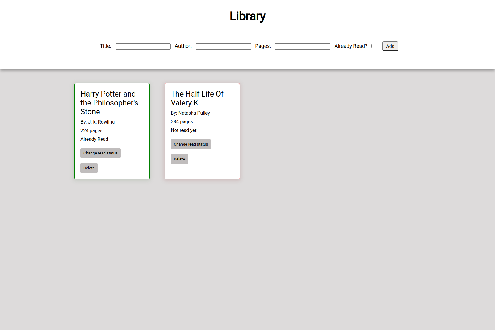

# Library

:point_right: [live demo](https://cmfernandes.github.io/library/) 

---

## About

This project is a "library" where the user can add and remove books.
 
Additionally, users can modify the status of each book to reflect their reading progress.

The main purpose of this project was to practice:
- Object constructors
- DOM manipulation

Assigment from [The Odin Project](https://www.theodinproject.com/lessons/node-path-javascript-library) Javascript course.